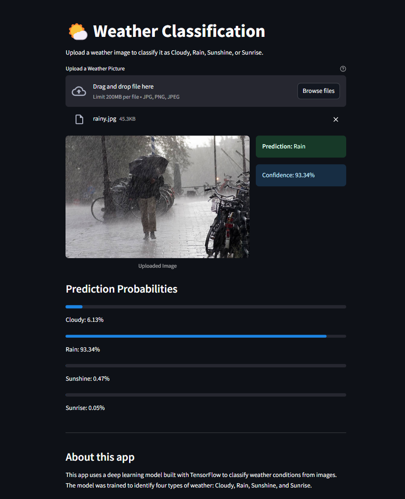

# 🌤️ Weather Classification Web App using Streamlit and TensorFlow

This project is a simple yet effective web application that classifies weather conditions from images using a deep learning model built with TensorFlow and Keras. The interface is created with Streamlit, allowing users to interactively upload weather images and receive instant predictions.

---

## 📌 Overview

The **Weather Classification Web App** identifies one of four weather conditions:

- ☁️ **Cloudy**
- 🌧️ **Rain**
- ☀️ **Sunshine**
- 🌅 **Sunrise**

Upload any image, and the app will classify it using a pre-trained deep learning model (`model.h5`). This tool showcases the potential of computer vision in real-world applications such as automated weather categorization and environmental monitoring.



> **Note:** The current model requires additional fine-tuning as predictions may not always be accurate. This is an ongoing project with room for improvement in model performance.

---

## 🚀 Features

- 🧠 **Deep Learning-Powered**: Built with TensorFlow and Keras.
- 🖼️ **Image Upload**: Upload `.jpg` or `.png` weather images through a simple UI.
- ⚙️ **Real-time Prediction**: Instantly returns the weather condition with high accuracy.
- 💾 **Model Caching**: Fast and efficient with Streamlit's caching mechanism.
- ✅ **User-Friendly Interface**: Clean design with informative outputs.

---

## 🛠️ How It Works

1. **Upload Image** via the file uploader widget.
2. **Preprocessing**: The image is resized to 128x128 pixels and normalized.
3. **Prediction**: The image is fed into a pre-trained CNN model.
4. **Output**: The most probable weather class is displayed on screen.

---

## 🧠 Model Details

The model (`model.h5`) is a Convolutional Neural Network trained on a labeled dataset of weather images.

- **Optimizer**: Adam
- **Loss Function**: Categorical Crossentropy
- **Input Shape**: (128, 128, 3)
- **Output Classes**: Cloudy, Rain, Sunshine, Sunrise

### Dataset

The model was trained using a curated dataset of weather images. You can access the dataset here:  
[Weather Classification Dataset on Google Drive](https://drive.google.com/drive/folders/1J6YJU8_ObabkdNx2zlUonCKVi4crtzff?usp=sharing)

---

## ▶️ How to Run

To run the app locally, follow these steps:

1. Clone the repository:
   ```bash
   git clone https://github.com/yowlshi/Weather-Classification-Web-App-Machine-Learning.git
   cd weather-classification-app
   ```

2. Install the required dependencies:
   ```bash
   pip install -r requirements.txt
   ```

3. Make sure the `model.h5` file is in the same directory as `app.py`.

4. Launch the Streamlit app:
   ```bash
   streamlit run app.py
   ```

The app will open in your default browser at `http://localhost:8501`.

---

## 📁 Project Structure

```
.
├── app.py            # Main Streamlit application
├── model.h5          # Pre-trained Keras model
├── README.md         # Project documentation
├── requirements.txt  # Required dependencies
└── images/           # Sample images and screenshots
    └── output.png    # Sample app interface
```

---

## 📷 Example Use Case

Upload a weather photo and see which of the following categories it belongs to:

- ☁️ Cloudy  
- 🌧️ Rain  
- ☀️ Sunshine  
- 🌅 Sunrise  

---

## 💡 Use Cases

- Automated weather classification using image input
- Educational demonstrations of CNN-based image classification
- Research and dataset labeling tools for weather-based projects

---

## 🚧 Future Improvements

- Model fine-tuning to improve accuracy and reduce misclassifications
- Expanding the dataset to include more diverse weather conditions
- Adding confidence scores to provide transparency in prediction reliability
- Implementing model explainability features to understand decision factors

---

## 🙌 Acknowledgments

Huge thanks to:

- **TensorFlow** and **Keras** for their powerful deep learning libraries
- **Streamlit** for enabling rapid development of data apps
- Open-source contributors who helped make these tools accessible and developer-friendly
